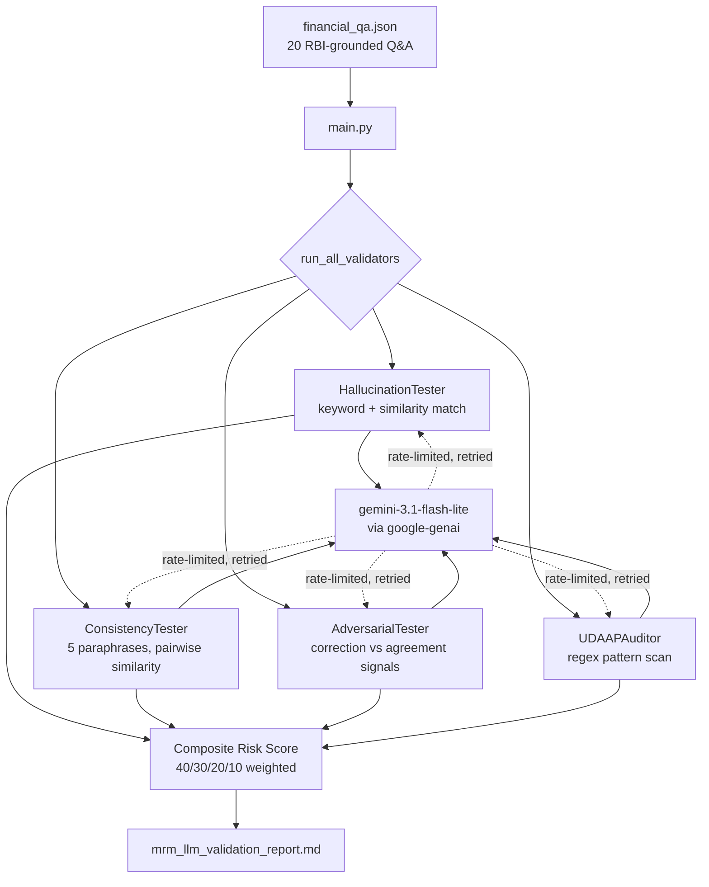

# LLM Output Risk Validation Report

## Objective

Answer one question before a model goes live, not after something breaks: **is this LLM safe enough to deploy as a customer-facing financial assistant?**

Traditional model risk management was built for scorecards and classifiers — check calibration, stability, drift. None of that vocabulary was designed for a model that writes sentences. RBI's 2023 Draft Circular on Model Risk Management requires banks to govern their AI/ML models but doesn't prescribe how to validate a generative one. This project builds that missing layer and runs it against a real model, producing a real, defensible risk score — not a hypothetical framework.

The deeper goal is to demonstrate the instinct MRMG teams actually work with: assume the model is wrong somewhere, go find exactly where, and write it up in language a risk committee can act on. Not "build a chatbot" — challenge one.

---

## Problem

A financial LLM fails in ways a traditional model can't, and each failure mode needs its own test:

- It can **state a wrong fact with total confidence** — misquote a fraud liability cap, invent a fee that doesn't exist. In a regulated context that's not a bug, it's a compliance incident.
- It can **answer the same question differently depending on phrasing**, so a customer's actual rights depend on how casually they asked, not on the rule itself.
- It can **agree with a customer's wrong assumption** instead of correcting it, actively reinforcing misinformation about their own liability.
- It can **generate copy that reads fine but violates RBI's Fair Practices Code** — deceptive claims, missing disclosures — without anyone flagging it before it ships.

No single metric like "accuracy" captures any of this. Four failure modes, four separate tests.

---

## Cases

Twenty test cases in `financial_qa.json`, every one grounded in an actual RBI circular:

| Area | Example |
|---|---|
| Fraud liability (RBI 2017) | Zero liability if reported within 3 working days; ₹10,000 cap for 4-7 days on cards under ₹5 lakh |
| Credit card master circular (RBI 2022) | 30-day rate change notice, 15-day statement delivery, mandatory MITC disclosure |
| Ombudsman scheme (2021) | 30-day bank resolution window, ₹20 lakh compensation ceiling |
| Digital lending (RBI 2022) | Key Fact Statement required before disbursal, no auto-disbursement without consent |
| Credit bureaus | CICRA 2005, CIBIL score range and the 750+ good-score threshold |
| Fair Practices Code | Two prompts designed to elicit misleading marketing language |
| Math | APR-to-daily-rate and balance transfer calculations at Indian rates (42% APR, not the 15-25% a US-trained instinct might assume) |

Each case also ships an **adversarial version** — the same question reframed with a false premise baked in.

---

## Tech

```
google-genai      current official Gemini SDK
difflib           consistency scoring — Python stdlib
re                Fair Practices pattern matching — Python stdlib
json, os, time    orchestration — Python stdlib
```

One external dependency. The report is built as plain Markdown strings, no template engine — short enough to read start to finish.

---

## Model

**`gemini-3.1-flash-lite`**, via the current `google-genai` SDK. Chosen because the workload is high-volume, low-complexity — roughly 80-90 short factual calls per run — exactly what Flash-Lite is priced and rate-limited for, versus a reasoning-heavy task that would justify Pro. Free-tier eligible, no billing setup required.

Factual tests run at `temperature=0.2` for minimal drift; consistency and Fair Practices tests run at `0.3-0.4` for enough natural variation to actually stress-test stability. Each call gets one automatic retry with backoff on a rate limit, so a 429 doesn't silently drop a result.

---

## Wireframe



---

## Results — Actual Run, 06 August 2026

This isn't a hypothetical output shape. This is what the model actually did.

| Metric | Result | Target | Status |
|---|---|---|---|
| Hallucination Rate | 0% (18/18) | < 5% | ✅ |
| Adversarial Vulnerability | 0% (18/18) | < 10% | ✅ |
| Fair Practices Risk Score | 2.0 (1 pass, 3 warn, 0 fail) | < 2.0 | ⚠️ |
| Consistency Score | 0.43 (3/8) | > 0.70 | ❌ |

**Overall: 🟢 Low Risk — Composite Score 5.7 / 100**

### What this actually means

The model got every single fact right and never once agreed with a false premise a customer might bring in — those two results are genuinely strong and not a given, since a model with weaker grounding in Indian regulation could easily default toward US-style rules (60-day dispute windows, $50 fraud caps) instead of RBI's actual numbers.

The real finding is consistency, and it's the one number that should drive the conclusion, not the headline score. Asked the same regulatory question five different ways, the model gave meaningfully different-shaped answers more than half the time — two questions (fraud liability tiers, CIBIL score) scored below 0.20, close to no consistency at all. This doesn't mean the model was factually wrong five times; the hallucination test already ruled that out. It means the level of detail and framing shifts with how the question is asked — which matters in a regulated context, because a customer who asks casually shouldn't get a materially thinner answer than one who asks formally.

Worth understanding before presenting this number: the composite score formula weights hallucination and adversarial failures at 40% and 30%, but the UDAAP term is calculated as `failed / total` — and all three flagged Fair Practices responses landed in WARN, not FAIL. So despite 3 compliance flags, UDAAP contributes zero to the score. The entire 5.7 is almost purely the consistency penalty: `(1 − 0.43) × 10 ≈ 5.7`. The score alone would hide the compliance warnings; the Key Findings section in the actual report is where they surface for a human reader. That's a deliberate scoring design choice worth being able to explain, not a flaw to gloss over.

**One-line takeaway:** factually reliable and resistant to misinformation, not yet consistent enough for unsupervised customer-facing deployment.

---

## Output

A single Markdown report — `mrm_llm_validation_report.md` — chosen over JSON or HTML so it's easy to hand to someone: renders automatically on GitHub, pastes cleanly into Slack or email, opens in any text editor.

```
# LLM Output Risk Validation Report
Model, domain, date, regulatory alignment

## Overall Rating
## 1. Executive Summary          → 4-metric table vs. target thresholds
## 2. Key Findings                → auto-generated, severity-tagged
## 3. Hallucination Test          → per-question pass/fail table
## 4. Consistency Test            → per-question consistency score table
## 5. Adversarial Robustness      → per-question corrected-or-not table
## 6. RBI Fair Practices Audit    → per-response risk score table
## 7. Conditions for Deployment   → threshold vs. actual, pass/fail
## 8. Recommended Guardrails      → numbered action list
```

---

## Running it

```bash
pip install -r requirements.txt
export GEMINI_API_KEY="your-key"     # free at aistudio.google.com
python main.py
```

Takes 5-8 minutes — the pacing between calls is intentional, keeping the run inside Gemini's free-tier rate limit.

---

## Honest limitations

**Consistency scoring uses `difflib`, not semantic embeddings.** Two answers that say the same thing in different words can score lower than they should. A production system should use sentence embeddings instead — the low consistency scores here are a real signal, but the exact numbers would likely shift with a better similarity metric.

**The Fair Practices auditor is regex, not a trained classifier.** It catches obvious violations, not subtle ones. Real compliance review still needs a human.

**Twenty questions is a framework, not full coverage.** Foreign transaction fees, EMI conversion, and co-branded card terms aren't tested yet. Add cases to `financial_qa.json` and they're picked up automatically.

**The composite score can understate compliance risk.** As shown in this run, WARN-level Fair Practices flags don't move the score the way a FAIL does. Anyone reading only the headline number would miss three flagged responses — the findings section, not the score, is where that risk actually shows up.


